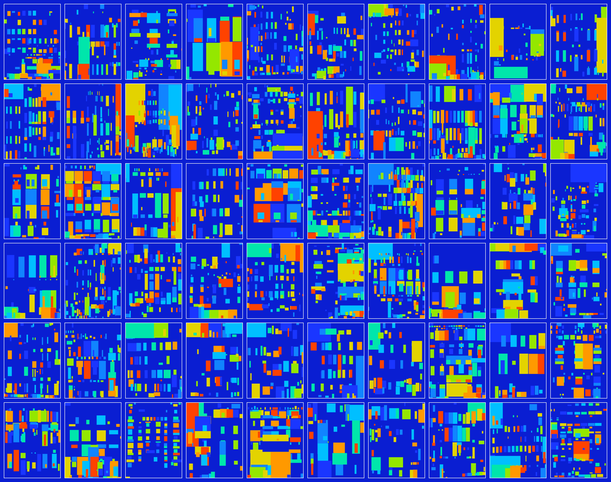
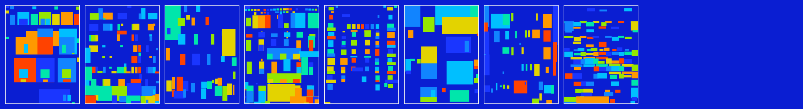

# Façade Cartography – Results

**What:** Turn façade segmentation into *interpretable metrics* (WWR, regularity, shading index) and *ranked visuals* for retrofit screening.  
**Why:** Quickly flag façades with **high WWR & low shading** (potential energy/glare risk).

## Start here
- **Top WWR:** 
- **Priority (High WWR + Low Shading):**  
  

## Figures
See `/figures` for:
- `blocks_vs_grid.png` – how segmentation becomes block representation  
- `rows_hist.png`, `median_cols_per_row_hist.png`, `stats_wwr_hist.png` – distributions  
- `contact_*` – contact sheets (top WWR / low WWR / priority / bad cases)

## Tables
In `/tables`:
- `stats_wwr_shading_clean.csv` – per-façade metrics  
- `priority_wwrHigh_shadeLow_clean.csv` – high-WWR & low-shading shortlist  
- `bad_metrics.csv` – outliers/quality issues (optional)

**Columns:**  
`image, wwr, shading_idx, rows, median_cols_per_row, regularity_index`

## Method (one paragraph)
Masks → morphology & grid blocks → metrics (WWR, regularity, shading index) → histograms & scatter → rule‐based priority (WWR ≥ 80th percentile & shading ≤ 20th percentile).

## Data & License
Demo on the CMP Facade dataset (respect its license).  
Unless noted otherwise: **figures/tables © You, CC BY 4.0**.  
(If code is added later: MIT for code is typical.)
